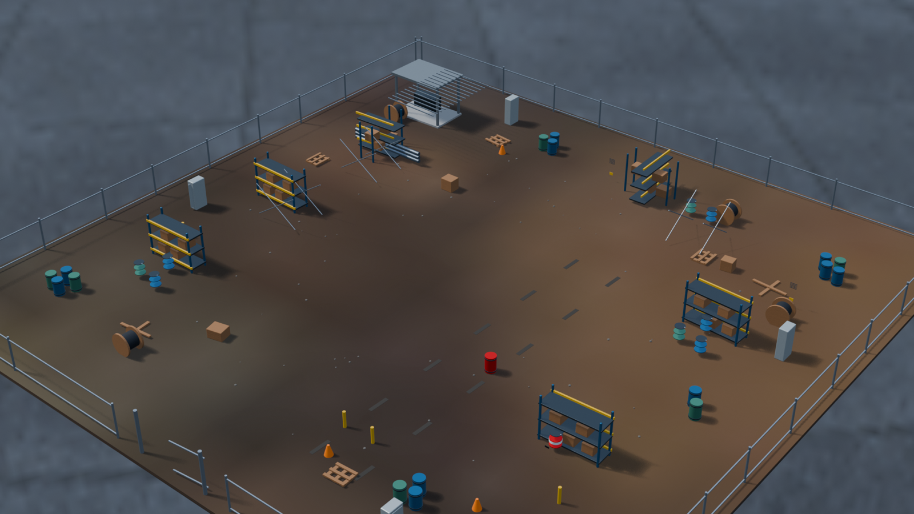

# SPAR - Sim Portable Autonomy Runtime



*The committed `utility_depot_40_v1` showcase, authored in Blender through
BlenderMCP and exported for MuJoCo.*

```text
  description   "a gravel utility depot with racks, barrels, and a red drum"
       |
       v
   author       BlenderMCP -> visual scene + collision proxies
       |
       v
    export      deterministic Blender -> OBJ/PNG + MJCF
       |
       v
   world.xml    the site alone; robots compose on at load time
       |
       v
      run       SPAR-GroundNav-v0   pure MuJoCo, PPO, no ROS
                sim/spar_sim        Nav2 + BT (ground), PX4 + BT (air)
       |
       v
  each failure becomes the next description
```

SPAR is a small robotics playground for learning ROS2, Nav2, behavior trees,
PX4, and MuJoCo. It is also a testbed for generating many diverse worlds
through an orchestrated LLM-and-Blender pipeline, training RL behaviors across
them, then running and evaluating the learned behaviors inside a deterministic
ROS 2 stack.

Behavior trees are configured for a Husky ground robot with Nav2 and a Skydio
X2 drone controlled by PX4 SITL. Both see the same world via a shared
camera-to-detection interface.

The working behavior is basic.

- patrol while a mission is active;
- inspect the red anomaly detected from the rendered camera;
- return home when the battery is low;
- resume after recharging.

## Install

Complete the [installation and BlenderMCP configuration guide](docs/install.md)
before using the commands below. It contains the exact macOS setup used for
SPAR and a shorter Linux equivalent. This README assumes Docker is running,
`uv sync` has completed, and BlenderMCP is connected.

## World generation

Why generate worlds at all? The leading approach to visuomotor policy learning
is uptraining a large pretrained vision-language or video model into an
action-output model, which inherits broad scene understanding and spends its
data budget mapping that to trajectories. It generalizes well in-distribution
and degrades on the tail: rare geometry, unfamiliar clutter, degenerate
lighting. Those configurations are sparse in the pretraining corpus and rare in
teleop. Field data only ever contains failures already encountered, and
collecting it needs a fleet. This pipeline is a bet that compositional
generation with LLMs in the loop can synthesize those out-of-sample
configurations on purpose, cheaply, before deployment surfaces them. See
[the research direction](docs/research.md).

BlenderMCP owns the generated layout and visual scene. The accepted `.blend`
contains detailed render geometry, explicit simple collision proxies, and
semantic sites. A deterministic exporter turns that scene into the OBJ/PNG
assets and MJCF consumed by SPAR.

For now, every newly generated environment is exactly 40×40 m. The autonomy
stack's current patrol behavior does not dynamically explore an unknown scene:
it navigates between explicit patrol goals. Its demo workflow therefore
includes a dedicated final BlenderMCP pass that sees the completed layout and
places reachable waypoints through its aisles.

### Generate and run a world

World creation happens in the AI client connected to BlenderMCP; the repository
owns the prompts, scene contract, export, and runtime steps.

1. Choose a lowercase world name and open a new Blender scene. Load
   [the utility-depot prompts](prompts/utility_depot.md) and send all three in
   order: initial 40×40 layout, detailing, then the
   recommended world-authored waypoint pass. That final prompt sends Blender
   the autonomy contract for marker names, order, aisle clearance, headings,
   and anomaly visibility. Replace `<REPO>` and `<WORLD>` before sending them.

2. Export the accepted waypoint scene. `--world-waypoints` reads the ordered
   Blender markers and writes two plain YAML parameter files:

   - `ground/src/spar_ground/config/worlds/<world>.yaml` contains the ground
     route as `[x, y, yaw, ...]`.
   - `air/src/spar_air/config/worlds/<world>.yaml` contains the air route as
     `[x, y, z, yaw, ...]`.

   The same export writes the world's MJCF and visual assets:

```bash
WORLD=utility_depot_40_v1

open -n -W -a Blender --args --background \
  "$PWD/artifacts/worldgen/$WORLD/waypoints.blend" \
  --python "$PWD/scripts/export_blender_world.py" -- \
  --world "$WORLD" --world-waypoints
```

3. Compile the exported MJCF and inspect it visually. These are ordinary
   Python scripts; no Make target is involved:

```bash
uv run python scripts/check_world_export.py "$WORLD"
uv run mjpython sim/inspect_world.py --world "$WORLD"  # macOS
# On Linux: uv run python sim/inspect_world.py --world "$WORLD"
```

4. Start that exact world in MuJoCo from the host:

```bash
make start_sim WORLD="$WORLD"
make view WORLD="$WORLD"  # optional live viewer; leave the sim running
```

5. In a second terminal, build and launch ground autonomy with the matching
   waypoint file. `world:=<name>` selects
   `config/worlds/<name>.yaml`:

```bash
make ros2_container

# Now inside the container:
colcon build --symlink-install
source install/setup.bash
WORLD=utility_depot_40_v1
ros2 launch spar_ground autonomy.launch.py world:="$WORLD"
```

6. In another host terminal, start the mission and observe its active behavior:

```bash
make shell

# Now inside the container:
scripts/mission.sh start
ros2 topic echo /husky/bt/status
scripts/mission.sh stop
```

With the simulator and autonomy launch still running, `make smoke` from the
host exercises the complete patrol, inspection, battery-return, recharge, and
resume arc.

`utility_depot_40_v1` is committed as the runnable showcase, including its
MJCF, OBJ/PNG assets, and ground and air waypoint files. New generated worlds
and editable Blender files remain local until deliberately promoted the same
way.
`--world-waypoints` is only needed by behaviors that consume explicit patrol
goals. A future behavior that dynamically plans its own route can omit the
waypoint pass and flag; the exporter will create the world without autonomy
waypoint files. See [world generation](docs/worldgen.md) for the complete scene
and export contracts.

## Ground quickstart: handwritten blank world

This shorter path uses `blank.xml` and the explicit waypoint file in
`config/worlds/blank.yaml`; generated worlds should use the complete workflow
above. Complete the install guide first.

Start the sim:

```bash
make start_sim
make view                 # optional host viewer
```

In a second terminal:

```bash
make ros2_container

# Inside the container:
colcon build --symlink-install
source install/setup.bash
ros2 launch spar_ground autonomy.launch.py world:=blank
```

In another container shell:

```bash
make shell
scripts/mission.sh start
ros2 topic echo /husky/bt/status
scripts/mission.sh stop
```

Run the unattended behavior check from the host:

```bash
make smoke
```

The sim owns `/clock`. If the sim restarts, restart the ROS launch too.

## Air track

The air image includes PX4 and takes longer to build. The current air demo
flies an explicit 3D route from the selected world's YAML file; it does not
avoid obstacles dynamically. Export checks that route against the world's
collision geometry.

```bash
WORLD=utility_depot_40_v1
make start_sim WORLD="$WORLD"
make ros2_container_air

# Inside the container:
colcon build --symlink-install
WORLD=utility_depot_40_v1
cd /opt/px4/build/px4_sitl_zenoh
PX4_SYS_AUTOSTART=10016 PX4_SIM_MODEL=none_iris \
  PX4_SIM_HOSTNAME=localhost ./bin/px4 -d > /tmp/px4.log 2>&1 &
./bin/px4-zenoh start
ros2 launch spar_air air.launch.py world:="$WORLD"
```

After PX4's estimator settles:

```bash
make shell_air
scripts/mission.sh start
ros2 topic echo /skydio/bt/status
```

`make smoke_air` runs takeoff, patrol, inspection, battery return, landing,
disarming, and relaunch.

## Editing the autonomy code

The main packages are:

```text
ground/src/spar_ground     ground behavior, localization, battery, launch
air/src/spar_air           air behavior and PX4 transforms
common/src/spar_perception shared Detection message and red-object detector
sim/spar_sim               MuJoCo stepping, rendering, sensors, transport
```

Behavior trees are XML in each robot package. Runtime parameters and launch
files live beside their code. The robot model owns its default spawn, so each
stack treats its own spawn as map `(0, 0)`. The current ground and air patrols
consume explicit world-specific waypoint files selected at launch. A future
dynamic route-planning behavior will not need those inputs.

After an initial `colcon build --symlink-install`, a ground-only C++ rebuild
can use:

```bash
cd build/spar_ground && make
```

Stop and relaunch the stack after rebuilding. ROS logs go to `logs/runNNN`
for ground and `logs/air/runNNN` for air. The simulator log is
`logs/sim.log`.

## Useful commands

Run `make` to list all stable commands. The common ones are:

| Task | Command |
| --- | --- |
| Start or stop MuJoCo | `make start_sim`, `make stop_sim` |
| Inspect one world without ROS (macOS) | `uv run mjpython sim/inspect_world.py --world blank` |
| Enter the running ground container | `make shell` |
| Enter the running air container | `make shell_air` |
| Open RViz in a browser | `make rviz` |
| Run ground or air behavior checks | `make smoke`, `make smoke_air` |
| Stop all containers | `make shut_down` |
